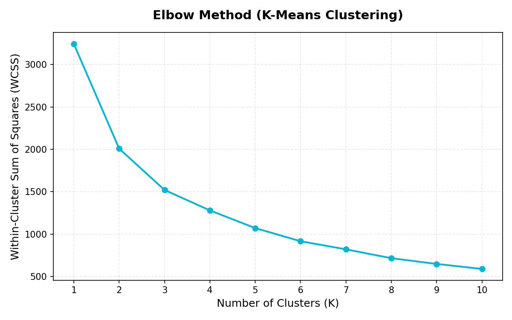
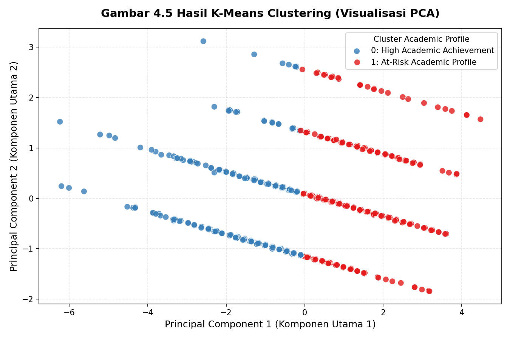
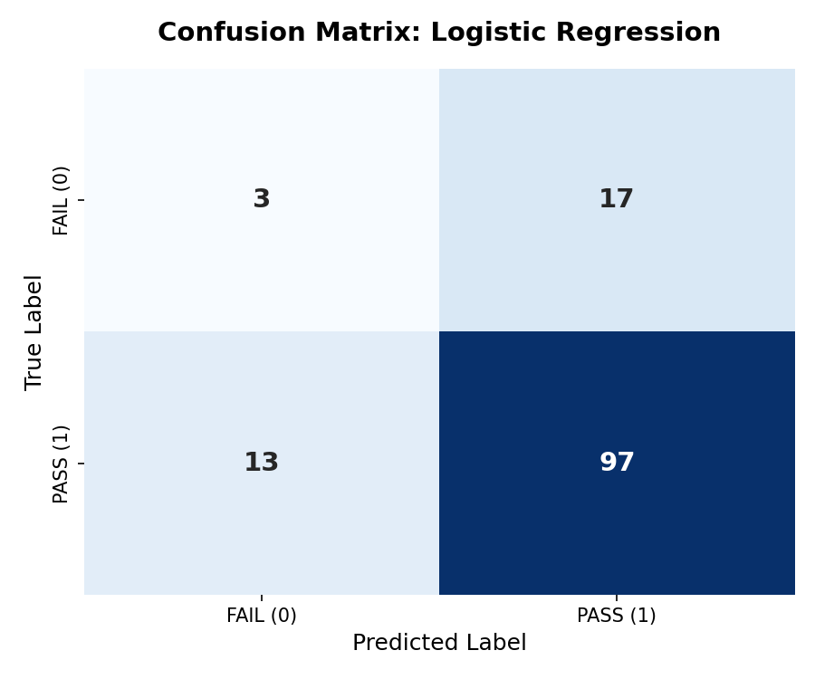
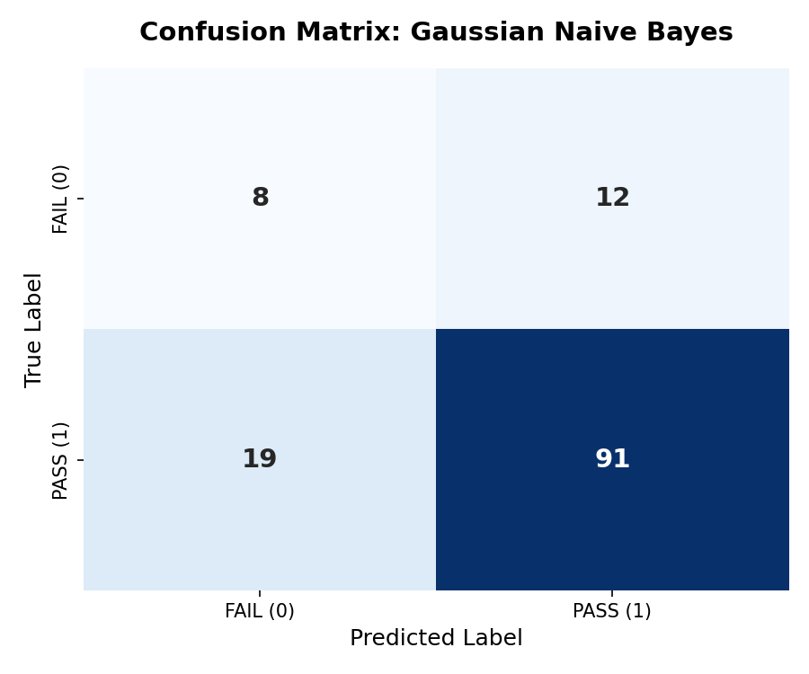

# AuraPredict: Analisis Performa & Peringatan Dini Akademis Siswa (Portuguese Course)

Dokumentasi ini berisi penjelasan menyeluruh mengenai proses pengerjaan, metodologi, hasil pemodelan, dan arsitektur deployment proyek data mining performa siswa berbasis dataset `student-por.csv`.

---

## 1. Pendahuluan & Tujuan Proyek (CRISP-DM Fase 1: Business Understanding)

### Latar Belakang & Masalah
Dalam ekosistem pendidikan, kegagalan akademis siswa dapat diantisipasi dan diminimalisir apabila institusi memiliki sistem deteksi dini (*early warning system*). Dengan memprediksi potensi kelulusan siswa sejak awal, guru dan pihak sekolah dapat memberikan intervensi khusus kepada siswa yang berisiko sebelum ujian akhir dilaksanakan.

### Tujuan Proyek
1.  **Segmentasi Profil Siswa (Unsupervised Learning)**: Mengelompokkan profil siswa menggunakan algoritma *K-Means Clustering* untuk membedakan karakteristik kelompok berprestasi tinggi (*High Achievers*) dengan kelompok rawan akademis (*At-Risk*).
2.  **Prediksi Kelulusan Siswa (Supervised Learning)**: Memprediksi status kelulusan siswa secara akurat (`Pass` / `Fail`) berbasis karakteristik sosial, demografis, dan kebiasaan belajar siswa menggunakan algoritma *Logistic Regression* dan *Gaussian Naïve Bayes*.
3.  **Deployment Waktu Nyata**: Menyebarkan hasil model ke dalam dashboard antarmuka web interaktif sisi klien (*client-side web dashboard*) untuk prediksi instan.

---

## 2. Pemahaman Data (CRISP-DM Fase 2: Data Understanding)

### Dataset
Dataset yang digunakan adalah `student-por.csv`, yang mencakup data performa akademis siswa dalam mata pelajaran bahasa Portugis di dua sekolah menengah di Portugal (*Gabriel Pereira* dan *Mousinho da Silveira*).

-   **Jumlah Rekor**: 649 siswa
-   **Jumlah Variabel**: 33 variabel (sosial, demografis, kebiasaan belajar, lingkungan rumah, dan nilai akademis)
-   **Fitur Kunci**:
    -   `studytime`: Jam belajar mingguan (skala 1-4).
    -   `failures`: Jumlah kegagalan akademis di kelas sebelumnya (skala 0-3).
    -   `absences`: Jumlah ketidakhadiran sekolah (skala 0-93).
    -   `G1`, `G2`: Nilai UTS periode 1 & 2 (skala 0-20).
    -   `G3`: Nilai UAS / Nilai Akhir (skala 0-20).

---

## 3. Persiapan Data (CRISP-DM Fase 3: Data Preparation)

Untuk memastikan keakuratan data dan mencegah kebocoran informasi (*data leakage*), serangkaian langkah pra-pemrosesan data dilakukan:

1.  **Pendefinisian Variabel Target**:
    Membuat variabel target biner `Pass` berdasarkan nilai akhir `G3`. Siswa dinyatakan **Lulus (1)** jika nilai `G3 >= 10`, dan dinyatakan **Rawan/Gagal (0)** jika nilai `G3 < 10`.
2.  **Pencegahan Data Leakage**:
    Menghapus variabel nilai ujian (`G1`, `G2`, `G3`) serta kolom target `Pass` dari matriks fitur $X$ untuk supervised learning. Hal ini krusial agar model memprediksi kelulusan siswa murni dari karakteristik non-nilai (seperti riwayat kegagalan sebelumnya, jam belajar, ketidakhadiran, tingkat pendidikan orang tua, dan kondisi keluarga) sebelum nilai ujian keluar.
3.  **Encoding Variabel Kategorikal**:
    Mengubah variabel kategorikal teks (misalnya `sex` ("M", "F"), `romantic` ("yes", "no"), dsb.) menjadi nilai integer terenkod alfabetis menggunakan `LabelEncoder`.
4.  **Normalisasi Fitur**:
    Menggunakan `StandardScaler` untuk menyamakan skala fitur numerik (seperti `age` dan `absences`) sehingga memiliki rata-rata 0 dan variansi 1.
5.  **Pemisahan Data**:
    Membagi dataset menjadi **80% data pelatihan** (*train set*) dan **20% data pengujian** (*test set*) menggunakan stratifikasi target untuk mempertahankan distribusi kelas biner.

---

## 4. Pemodelan & Evaluasi (CRISP-DM Fase 4 & 5: Modeling & Evaluation)

### A. Unsupervised Learning: K-Means Clustering
Jumlah cluster optimal ditentukan menggunakan **Elbow Method** (Gambar 4.4), di mana penurunan nilai WCSS (Within-Cluster Sum of Squares) mulai melambat secara signifikan pada K=2.

Model K-Means dilatih menggunakan fitur-fitur akademis (`studytime`, `failures`, `G1`, `G2`, `G3`) dan menghasilkan **Silhouette Score sebesar 0.3390** pada K=2.

#### Tabel 4.4 Hasil K-Means Clustering (Rata-rata Fitur per Cluster)

| Cluster | Deskripsi Profil | Jumlah Siswa | Rata-rata Study Time | Rata-rata Failures | Rata-rata G1 | Rata-rata G2 | Rata-rata G3 |
| :---: | :--- | :---: | :---: | :---: | :---: | :---: | :---: |
| **0** | *High Academic Achievement* | 345 Siswa | 2.20 | 0.01 | 13.35 | 13.59 | 14.10 |
| **1** | *At-Risk Academic Profile* | 304 Siswa | 1.63 | 0.46 | 9.18 | 9.28 | 9.42 |

### B. Supervised Learning: Klasifikasi Kelulusan
Dua model supervised learning dilatih pada data latih non-leakage untuk memprediksi target `Pass`:

| Model Klasifikasi | Akurasi | Presisi (Lulus) | Recall (Lulus) | F1-Score (Lulus) |
| :--- | :---: | :---: | :---: | :---: |
| **Logistic Regression** | **76.92%** | 85.09% | **88.18%** | **86.61%** |
| **Gaussian Naïve Bayes** | 76.15% | **88.35%** | 82.73% | 85.45% |

#### Evaluasi Confusion Matrix

Untuk mengukur persentase prediksi benar dan salah secara detail (True Positive, False Positive, True Negative, False Negative), berikut adalah visualisasi matriks kekacauan (*confusion matrix*) dari kedua model:

##### Gambar 4.6 Confusion Matrix Logistic Regression

##### Gambar 4.7 Confusion Matrix Naive Bayes

-   **Logistic Regression** unggul dalam metrik *Recall* (sensitivitas mendeteksi kelulusan) dan *F1-Score*.
-   **Gaussian Naïve Bayes** unggul dalam metrik *Precision* (ketepatan prediksi kelulusan).

---

## 5. Penyebaran & Aplikasi Interaktif (CRISP-DM Fase 6: Deployment)

### Parameter Eksportir ke JSON
Untuk mendukung arsitektur web modern, parameter matematis dari model Python diekstraksi ke JSON di akhir notebook:
-   **Logistic Regression**: Bobot koefisien dan konstanta intersep.
-   **Gaussian Naïve Bayes**: Nilai prior kelas, theta (rata-rata), dan variansi.
-   **Scaler**: Nilai rata-rata (*mean*) dan skala standar deviasi (*scale*).

### Dashboard Web Interaktif (Vite + React + Tailwind CSS v4)
Aplikasi web dashboard didesain dengan bahasa visual **Digital Brutalism** dikombinasikan dengan **Formalist Minimalism** (terinspirasi dari visual dramatis Robert Wilson dan Edward Hopper):
-   **Overview**: Widget statis untuk memantau rekor data, pass rate, dan fitur.
-   **Supervised & Unsupervised**: Grafik komparasi performa model dan karakteristik cluster.
-   **Real-Time Predictor**: Form input data siswa yang melakukan inferensi langsung di browser menggunakan parameter model JSON yang di-hardcode dalam JavaScript (tanpa server backend Python).
